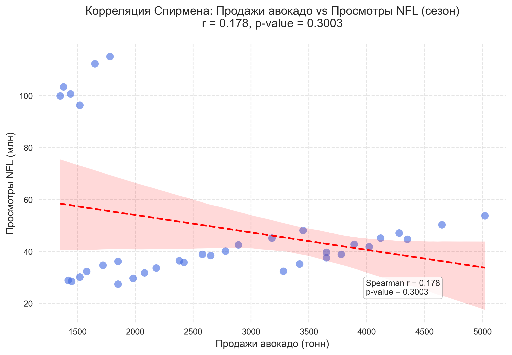

# Исследование: Влияние просмотров NFL на продажи авокадо
NFL - National Football League

Каждый год миллионы американцев потребляют мексиканскую закуску гуакамоле во время просмотра игр НФЛ (сентябрь-февраль) и Superbowl (январь - февраль). Основной ингредиент закуски - авокадо. Именно поэтому импорт и продажи авокадо в США возрастают на 30-40% период с января по февраль.

[Avocados and the Super Bowl: a win-win for agriculture and sports.](https://producepay.com/blog/avocados-and-the-super-bowl-a-win-win-for-agriculture-and-sports/)
[New National Guacamole Day Survey Reveals Guacamole as a Key Part of Football Game Day Rituals](https://www.prnewswire.com/news-releases/new-national-guacamole-day-survey-reveals-guacamole-as-a-key-part-of-football-game-day-rituals-302247859.html)

Проверим гипотезу о том, что продажи авокадо и сезонная популярность просмотра футбольных матчей имеют связь.

## 📌 Методология
1. Сгенерированы данные:
   - Продажи авокадо за 2018-2023гг.
   - Статистика просмотров NFL за тот же период
2. Визуализация: наслоение графиков по годам
3. Статистический анализ:
   - Оценка нормальности распределения
   - Выбор метода рассчета корреляции
   - Формулировка нулевой и альтернативной гипотез
   - Расчет корреляции и интерпретация результатов
   - Визуализация (график рассеяния с рангами)

## Генерация датасета
Были сгененрированы 2 датасета на основе трендов 2018-2023гг.
- Продажи авокадо в США
- Количество зрителей NFL в США

## Визуализация: наслоение графиков по годам

## Оценка нормальности распределения
Для выбора методоа расчета корреляции определим, распределены ли величины нормально.
Построим гистограммы в сравнении с графиком нормального распределения для демонстрации того, что обе величины распределены ненормально. Продажи авокадо имеют правостороннюю асимметрию (пик слева, длинный хвост справа). Просмотры NFL имеют несколько пиков (мультимодальное распределение).

 .
 .

## Выбор метода расчета корреляции

Для определения корреляции между ненормально распределенными величинами выберем метод корреляции Спирмена.
Этот метод оценивает **ранги** значений вместо **самих значений**, а именно существует ли монотонная связь: растут/падают ли ранги одной величины при росте/падении другой.

## Формулировка гипотез
- **Нулевая (H₀):** Ранги продаж авокадо и ранги просмотров NFL статистически независимы, нет монотонной зависимости (при росте просмотра NFL нет роста продаж авокадо, то есть нет монотонной связи).  
- **Альтернативная (H₁):** Существует монотонная зависимость между рангами продаж авокадо и рангами просмотров NFL.

## Расчет корреляции и интерпретация результатов
Выберем только месяцы сезона NFL (сентябрь-февраль), так как просмотры в остальные месяцы близки к нулю. Разделим отрезок на два: В период сентябрь - ноябрь проходят матчи плей-офф, а в период до февраля проводится подготовка к Superbowl.
Мы наблюдаем, что в разные периоды корреляция разная:

### Сентябрь - октябрь - ноябрь ###
Коэффициент Спирмена (r): 0.633
p-value: 0.005

### Декабрь - январь - февраль ###
Коэффициент Спирмена (r): -0.147
p-value: 0.561

## 🔍 Статистические выводы
*p-value рассчитывается через функцию scipy.stats.spearmanr()

1. Сентябрь - октябрь - ноябрь

r: -1 < 0.633 < 1
Умеренная положительная связь между сезонной популярностью футбола и продажами авокадо.
p-value: 0.005 < 0.05
Результат статистически значим, а значит связь между продажами и просмотром не случайна.
   - Отвергаем H₀ и принимаем H₁: существует статистически значимая монотонная зависимость между продажами авокадо и просмотрами NFL в период Сентябрь–Ноябрь.

2. Декабрь - январь - февраль

r: -1 < -0.147 < 1
Связь слабая отрицательная.
p-value: 0.561 > 0.05
Результат незначим, и корреляция может быть случайной.
   - Не отвергаем H₀, альтернативная гипотеза не подтверждается.

**Комментарий**
Осенью есть значимая положительная связь, а зимой (во время сезона Superbowl) она отсутствует. Это значит, что нельзя однозначно сказать, что продажи авокадо поднимутся в сезон просмотра футбола.

## ⚠️ Ошибки тестирования
### Сентябрь - ноябрь
- Ошибка первого рода
Отвержение гипотезы о том, что продажи и просмотры независимы, оказалось ошибочным, то есть мы увидели связь там, где ее на самом деле нет. Вероятность такой ошибки при p = 0.005 равна 0.5%

- Ошибка второго рода
Мы не отвергли нулевую гипотезу о независимости величин, а в реальности связь существует. В таком случае есть вероятность упустить возможность использовать реальную зависимость в маркетинговых целях. Риск совершить такую ошибку высок из-за небольшого объема данных.

### Декабрь - февраль
- Ошибка первого рода
Отвергаем гипотезу о том, что связи нет, а продажи и просмотры на самом деле не зависят друг от друга.
p-value = 0.561 > 0.05, а значит мы не совершили такую ошибку! Рис такой ошибки был всего 5%, но мы ее избежали.

- Ошибка второго рода
Принимаем гипотезу о том, что связи нет, но ошибочно - просмотры футбола действительно влияют на продажи авокадо.
Возможно, слабая связь (r = -0.147) есть, однако данных слишком мало.

## 📝 Заключение
Если в период сентябрь-ноябрь мы совершаем ошибку второго рода, то мы игнорируем потенциальные маркетинговые возможности и упускаем продажи: не используем NFL как канал продвижения авокадо, перераспределяем средства на рекламу в соцсетях вместо того, чтобы пустить таргетинг на футбольных болельщиков. Уточнить показатели помогут:

а) сбор данных за 10+ лет

б) снизить уровень значимости хотя бы для пилотных исследований

В зимний период, совершая ошибку первого рода, мы ошибочно заявляем о существовании связи. Тогда мы ошибочно считаем болельщиков NFL целевой аудиторией зимой и разрабатываем специальные футбольные акуии, которые не работают. Такая ошибка не была совершена, а чтобы полностью ее исключить, нужно использовать еще более строгий уровень значимости (0.01)

> *Автор: [vaganova-j-a], дата: 2025*  
> *Методология: Python (pandas, scipy, matplotlib)*
