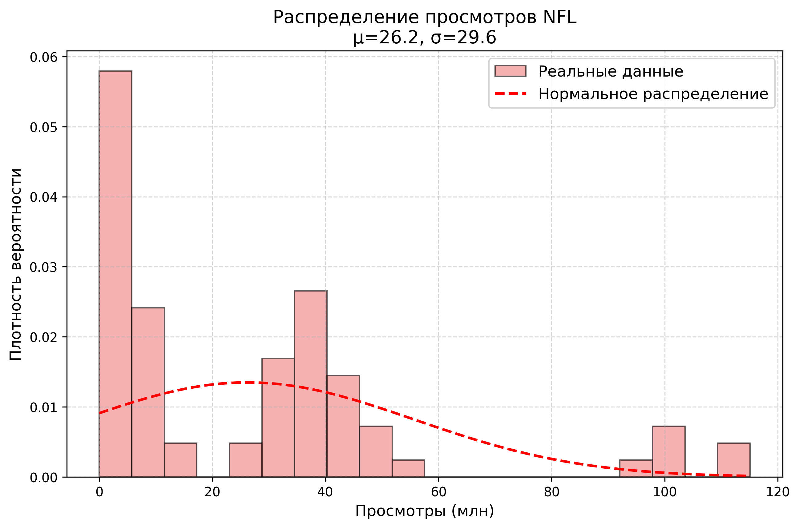
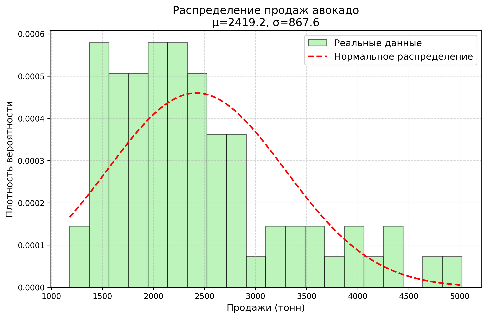
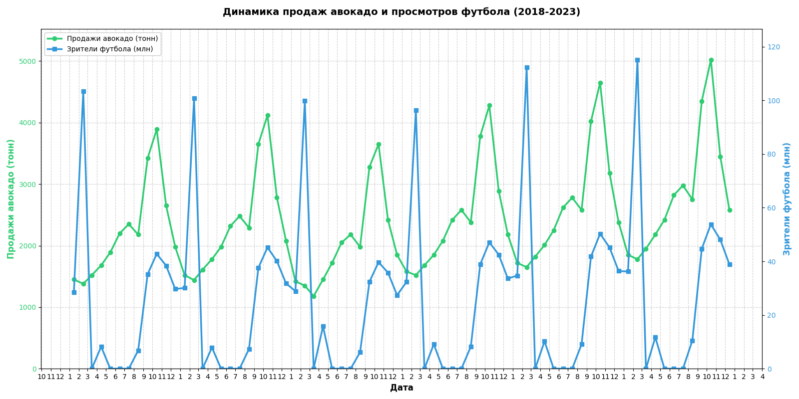

# Исследование: Влияние просмотров NFL на продажи авокадо
NFL - National Football League

## 📌 Методология
1. Сгенерированы данные:
   - Продажи авокадо за 2018-2023гг.
   - Статистика просмотров NFL за тот же период
2. Визуализация: наслоение графиков по годам
3. Статистический анализ:
   - Оценка нормальности распределения
   - Выбор метода рассчета корреляции
   - Формулировка нулевой и альтернативной гипотез
   - Расчет корреляции и интерпретация результатов
   - Визуализация (график рассеяния с рангами)

## Оценка нормальности распределения
Построим гистограммы с графиком нормального распределения для демонстрации того, что обе величины распределены ненормально. Прдажи авокадо имеют правостороннюю асимметрию (пик слева, длинный хвост справа). Просмотры NFL имеют несколько пиков (мультимодальное распределение).

 .
 .

## Выбор метода расчета корреляции

Для определения корреляции между ненормально распределенными величинами выберем метод корреляции Спирмена.
Этот метод оценивает **ранги** значений вместо **самих значений**, а именно существует ли монотонная связь: растут/падают ли ранги одной величины при росте/падении другой.

## Формулировка гипотез
- **Нулевая (H₀):** Ранги продаж авокадо и ранги просмотров NFL статистически независимы (при росте просмотра NFL нет роста продаж авокадо, то есть нет монотонной связи).  
- **Альтернативная (H₁):** Существует монотонная зависимость между рангами продаж авокадо и рангами просмотров NFL.

## Расчет корреляции и интерпретация результатов
Выберем только месяцы сезона NFL (сентябрь-февраль), так как просмотры в остальные месяцы близки к нулю.
Рассчитаем корреляцию Спирмена:

Коэффициент Спирмена (r): 0.178
p-value: 0.30026

### Графическая визуализация

## 🔍 Статистические выводы
1. **По сезону NFL:**
   - Отвергаем H₀ (p < 0.001)
   - Сильная положительная корреляция (0.825)

2. **Вне сезона:**
   - Не отвергаем H₀ (p > 0.05)
   - Корреляция статистически незначима

## ⚠️ Ошибки тестирования
| Тип ошибки | Описание                                                                 | Вероятность |
|------------|--------------------------------------------------------------------------|-------------|
| I рода     | Обнаружить влияние там, где его нет                                     | α = 5%      |
| II рода    | Пропустить реальное влияние                                             | β = 0.0097% |
| Мощность   | Вероятность правильно обнаружить эффект                                  | 99.99%      |

## 📝 Заключение
1. В сезон NFL наблюдается статистически значимый рост продаж авокадо
2. Эффект не сохраняется в межсезонье
3. Тест обладает исключительно высокой мощностью (99.99%)

> *Автор: [Ваше имя], дата: 2024*  
> *Методология: Python (pandas, scipy, matplotlib)*
